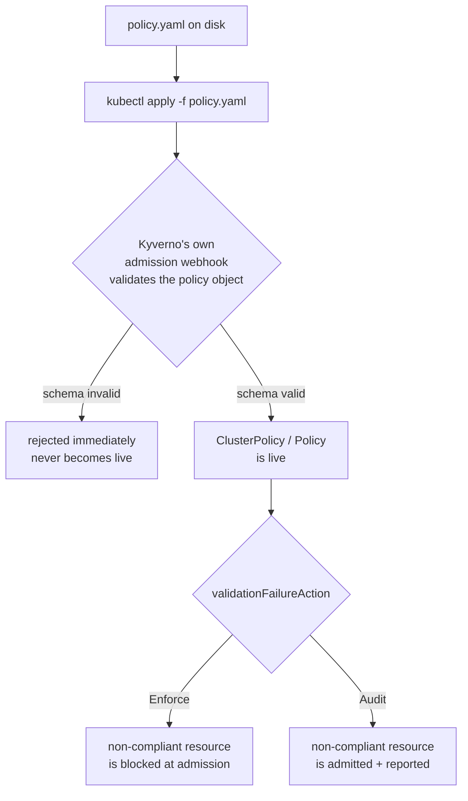

# Getting a Policy Live: ClusterPolicy vs Policy & the Admission Path

Writing a syntactically correct `ClusterPolicy` is not the same thing as having a policy that is actually protecting your cluster. Between those two states sits a small but important set of operational mechanics: applying the object, confirming Kyverno accepted and is enforcing it, and choosing whether a failing resource gets blocked outright or merely logged. This module is about that gap — the difference between a policy that exists on disk and a policy that is live.

## How this module is organised

1. **[Part 1 — Applying ClusterPolicy & Policy with kubectl](./course-01-applying-clusterpolicy-and-policy-with-kubectl.md)** — applying, checking readiness, updating, and deleting a policy object with ordinary `kubectl` commands.
2. **[Part 2 — Enforce vs Audit at Apply Time](./course-02-enforce-vs-audit-at-apply-time.md)** — what `validationFailureAction` actually controls, and the standard Audit-then-Enforce rollout pattern.

## Learning objectives

After this module you can:

- Apply, inspect, update, and delete a `ClusterPolicy`/`Policy` object using `kubectl apply`, `kubectl get`, `kubectl describe`, and `kubectl delete`.
- Explain that Kyverno validates the policy object itself at apply time, and that a malformed policy is rejected before it ever becomes live.
- Explain the difference between `validationFailureAction: Enforce` (blocks at admission) and `Audit` (admits and records).
- Describe why teams typically ship a new policy as `Audit` before flipping it to `Enforce`, and what `validationFailureActionOverrides` is for.

## Before you start

You should already be comfortable with basic `kubectl` usage (`kubectl get`, `kubectl apply -f`, `kubectl describe`) and know what a `ClusterPolicy` is at a structural level. The linked lab gives you a kind Kubernetes cluster with Kyverno pre-installed and `kubectl` already configured. Every command in this module is meant to be run in that cluster's terminal.
