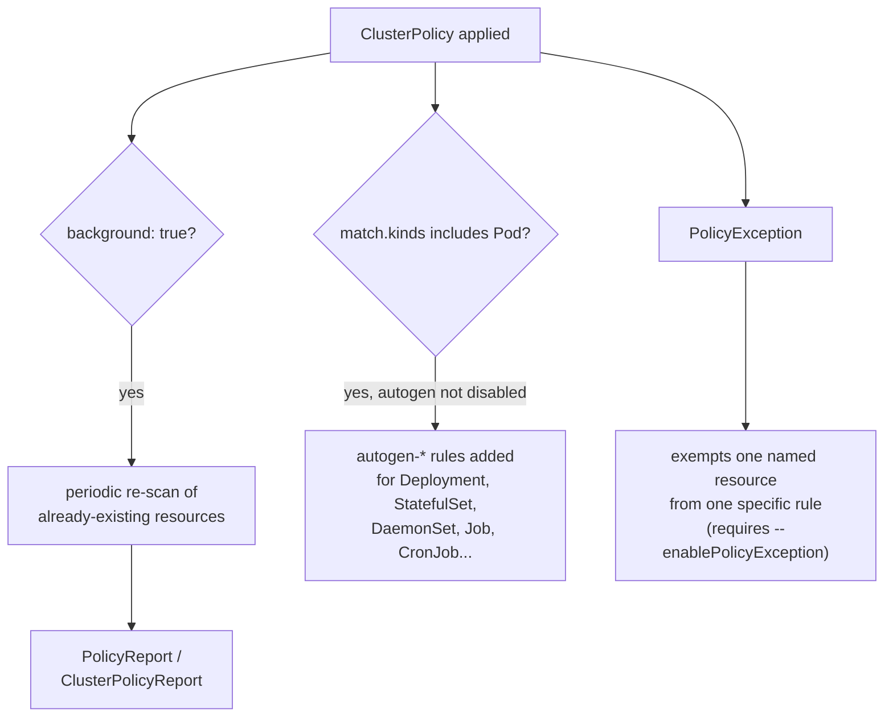

# Applying Beyond Admission: Background Scans, Autogen & Exceptions

Admission control only ever looks at a resource the moment it is created or updated. It has nothing to say about the Deployment that has been sitting in your cluster for eight months, or about a plain `Pod`-scoped rule's blind spot for the Deployment that owns it. This module covers the three mechanisms Kyverno gives you to close those gaps: background scanning of resources that already exist, autogen rules that extend a Pod-scoped rule up to its owning controllers, and PolicyExceptions for a scoped, auditable override when a rule is correct in general but wrong for one specific resource.

## How this module is organised

1. **[Part 1 — Background Scanning Already-Existing Resources](./course-01-background-scanning-already-existing-resources.md)** — what `background: true` actually re-evaluates, and what it never touches.
2. **[Part 2 — Autogen for Pod Controllers & PolicyExceptions](./course-02-autogen-and-policyexceptions.md)** — how a Pod-scoped rule reaches Deployments automatically, and how to carve out a scoped exception without editing the policy.

## Learning objectives

After this module you can:

- Explain what `background: true` does, that it only meaningfully applies to `validate` rules, and where its findings are recorded.
- Turn background scanning off for a rule with `background: false` and explain when you'd want to.
- Explain Kyverno's autogen mechanism: why a `Pod`-scoped rule also protects Deployments/StatefulSets/etc. at admission time, and how to read or disable it via the `pod-policies.kyverno.io/autogen-controllers` annotation.
- Enable `PolicyException` support on a cluster and write one that exempts a specific resource from a specific rule.

## Before you start

This module assumes you've completed Module 1, or are already comfortable applying a `ClusterPolicy` and reading `validationFailureAction`. The linked lab gives you a kind Kubernetes cluster with Kyverno pre-installed and a pre-existing non-compliant Deployment already running, to simulate a real "we're turning on policy against a cluster that already has workloads" scenario.
