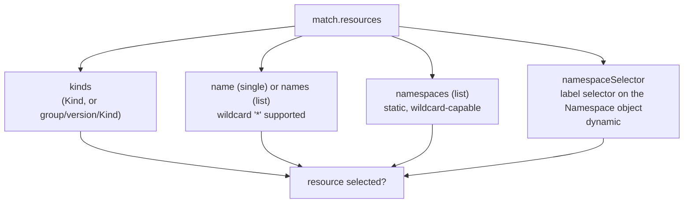

# match/exclude Fundamentals: Kinds, Names & Namespaces

Every Kyverno rule opens with the same question: *which resources does this rule even get to look at?* That question is answered entirely by the rule's `match` block (and narrowed further by an optional `exclude` block). Get this wrong and the rest of the rule — however correct its `validate`, `mutate`, or `generate` logic is — either fires on the wrong resources or never fires at all.

This module works through the first layer of that selection: matching by resource `kind`, by resource `name`, and by the `namespace` the resource lives in — both the static list form and the dynamic, label-driven `namespaceSelector` form.

## How this module is organised

1. **[Part 1 — Selecting by Kind, Name & Wildcards](./course-01-selecting-by-kind-name-and-wildcards.md)** — `resources.kinds`, `name` vs `names`, and what the `*` wildcard actually matches.
2. **[Part 2 — Namespaces & namespaceSelector](./course-02-namespaces-and-namespaceselector.md)** — the static `namespaces` list versus the dynamic, label-driven `namespaceSelector`.

## Learning objectives

After this module you can:

- Write a `match.resources.kinds` list, including a qualified `group/version/Kind` entry when disambiguation is needed.
- Choose between `name` and `names`, and predict exactly what a `*` wildcard will and won't match.
- Scope a rule to a static list of namespaces with `resources.namespaces`.
- Scope a rule dynamically to any namespace carrying a given label with `namespaceSelector`, and explain why that scope can change without editing the policy.

## Before you start

This module assumes you're already comfortable with the basic shape of a `ClusterPolicy`/`Policy` (`spec.rules`, one action per rule). No new lab infrastructure is needed beyond a kind cluster with Kyverno installed and `kubectl` configured, which the linked lab provides.
