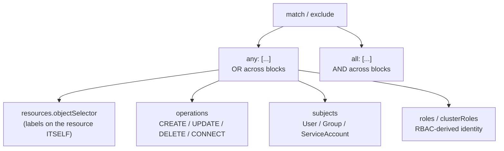

# Selecting by Identity & Operation

Kind, name, and namespace all describe *what* a resource is. This module covers two more axes of selection Kyverno gives you: *what kind of write* is happening to it (`operations`), and *who* is doing the writing (`subjects`, `roles`, `clusterRoles`). It also formalizes the `any`/`all` boolean structure you've been quietly using throughout this section, since combining these axes correctly depends on understanding whether Kyverno treats a set of conditions as OR or AND.

## How this module is organised

1. **[Part 1 — objectSelector & Operations](./course-01-objectselector-and-operations.md)** — filtering by the matched resource's own labels, and restricting a rule to specific admission verbs.
2. **[Part 2 — subjects, roles, clusterRoles & any/all](./course-02-subjects-roles-clusterroles-and-any-all.md)** — selecting (or excluding) by requester identity, and the OR/AND combinators that tie every selection field together.

## Learning objectives

After this module you can:

- Use `objectSelector` to scope a rule to resources carrying specific labels, and explain how it differs from `namespaceSelector`.
- Restrict a rule to specific admission operations (`CREATE`, `UPDATE`, `DELETE`, `CONNECT`).
- Use `subjects` to exclude (or include) requests from a specific `User`, `Group`, or `ServiceAccount`.
- Explain the difference between `subjects` and `roles`/`clusterRoles` as identity-selection mechanisms.
- Read and write `match.any`/`match.all` (and the equivalent under `exclude`) and predict the OR/AND outcome for a given combination.

## Before you start

This module builds directly on Module 1's `kinds`/`names`/`namespaces`/`namespaceSelector`. The linked lab gives you a kind Kubernetes cluster with `kubectl` already configured, including a ServiceAccount you'll impersonate with `kubectl --as=`.
