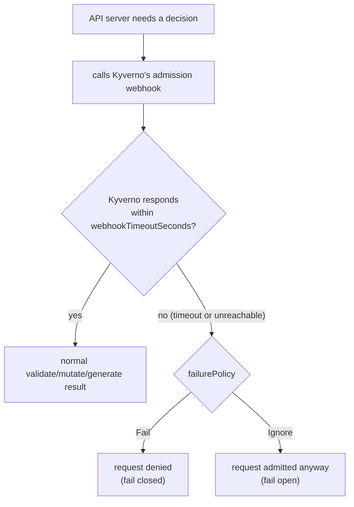

# Policy-Level Settings: failurePolicy, Timeouts & Schema Validation

A Kyverno policy does not run in a vacuum. Every time the API server needs a decision from Kyverno's admission webhook, it is making a network call — and network calls can be slow, or they can fail outright. This module covers the settings that decide what happens at the edges of that call: how long the API server waits, what it does if Kyverno never answers, and how Kyverno protects itself from accepting a malformed policy in the first place.

None of these settings change what a rule *matches* or what it *does* to a resource. They change how resilient — or how strict — the policy is as a piece of live cluster infrastructure.

## How this module is organised

1. **[Part 1 — failurePolicy & webhookTimeoutSeconds](./course-01-failurepolicy-and-webhooktimeoutseconds.md)** — what happens when Kyverno can't answer in time, and how long the API server is willing to wait.
2. **[Part 2 — schemaValidation & Policy-wide background](./course-02-schemavalidation-and-policy-wide-background.md)** — Kyverno validating its own policy resources, and revisiting `background` as a setting you configure deliberately, not just accept as a default.

## Learning objectives

After this module you can:

- Explain the difference between `failurePolicy: Fail` (fail closed) and `failurePolicy: Ignore` (fail open), and pick the right one for a given policy's risk profile.
- Explain what `webhookTimeoutSeconds` controls, and its default and maximum values.
- Explain what `schemaValidation` does and why it defaults to `true`.
- Decide when a policy should set `background: false` because its logic depends on admission-only request data.

## Before you start

This module assumes you're comfortable applying `ClusterPolicy` resources and reading their `spec` (Section 010). The linked lab gives you a kind Kubernetes cluster with `kubectl` already configured and Kyverno already installed.
