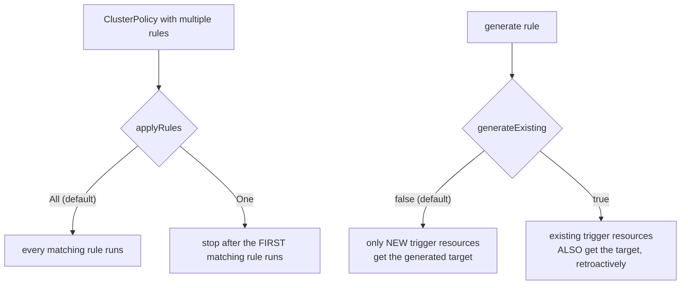

# Rule-Level Settings: applyRules, generateExisting & mutateExistingOnPolicyUpdate

Module 1 covered settings about how resilient a policy is at the webhook boundary. This module covers settings about *what* a policy's rules actually do once they run — specifically, two things that trip up almost everyone the first time they hit them: whether a policy's rules all run together or stop at the first match, and whether Kyverno's `generate`/`mutate` rules only ever look forward at new resources, or can also reach back and touch what's already sitting in the cluster.

## How this module is organised

1. **[Part 1 — applyRules: All vs One](./course-01-applyrules-all-vs-one.md)** — running every matching rule cumulatively vs stopping at the first match.
2. **[Part 2 — generateExisting & mutateExistingOnPolicyUpdate](./course-02-generateexisting-and-mutateexistingonpolicyupdate.md)** — making `generate` and `mutate` rules reach back and affect resources that already existed before the policy did.

## Learning objectives

After this module you can:

- Explain the difference between `applyRules: "All"` and `applyRules: "One"`, and identify when a policy's rules should be mutually exclusive.
- Explain why `generate` rules are forward-only by default, and what `generateExisting: true` changes.
- Explain what `mutateExistingOnPolicyUpdate` does for a `mutate` rule with a `targets` block, and how it differs from ordinary admission-time mutation.

## Before you start

This module assumes you're comfortable writing `generate` and `mutate` rules (Fundamentals of Kyverno domain) and applying `ClusterPolicy` resources with `kubectl` (Section 010 of this domain). The linked lab gives you a kind Kubernetes cluster with `kubectl` already configured and Kyverno already installed.
